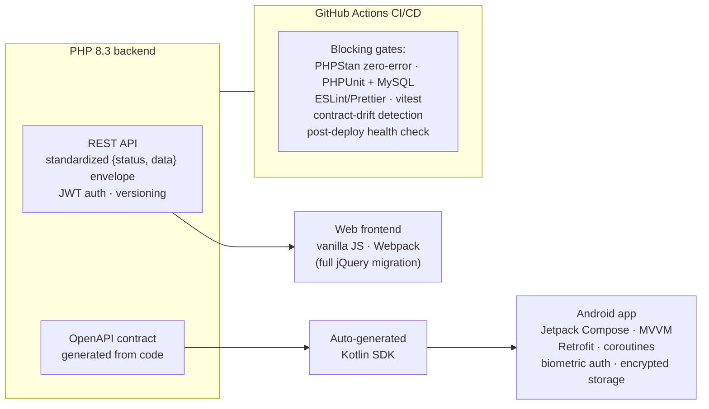

# Jean-François Rondeau

**Engineering & Technology Executive — Complex Systems, Software & AI**
Ph.D. in Applied Acoustics & Fundamental Physics · Former deep-tech subsidiary CEO · Hands-on software practitioner

[🌐 jfrondeau.fr](https://jfrondeau.fr) · [💼 LinkedIn](https://www.linkedin.com/in/jean-francois-rondeau/) · [✉️ contact@jfrondeau.fr](mailto:contact@jfrondeau.fr)

---

## About

I lead global engineering organizations at the convergence of complex physical systems (acoustics, materials, embedded electronics), modern software architecture and enterprise AI. Executive track record: order intake doubled from €250M to €520M in two years, +8% operating income on a diversified hardware+software subsidiary, corporate AI roadmap executed at Executive Committee level.

This profile exists to document the *hands-on* side of that claim.

## Featured work — Le Tableau Noir

A production SaaS platform for schoolteachers (lesson preparation, curriculum progressions, class journal, report cards, PDF export), designed, built, secured and operated **solo**, alongside my executive career.

> The main repositories (`letableaunoir`, `letableaunoir-mobile`) are private — they contain production code and user-facing infrastructure. Architecture reviews or code walkthroughs available on request.

**Scale & longevity**

| Metric | Value |
|---|---|
| Continuous delivery | 4.5 years (Dec 2021 → today), 980+ backend commits |
| Codebase | ~55,000 lines (PHP 8.3 · JavaScript · CSS · Kotlin) |
| Database migrations | 26, all idempotent, rolled dev → staging → production |
| Test suites | 50 PHP test files (unit + real-MySQL integration) · 17 JS test files (vitest) |
| Android companion app | Built and shipped in **under two weeks** (89 commits) by reusing the existing API contract |

**Architecture — one contract, two clients**

**Engineering discipline**

- CI/CD pipeline where **tests block deployment** — quality gates as guardrails, not formalities.
- The OpenAPI contract is a first-class artifact: regenerated in CI, any uncommitted drift fails the build; a dedicated workflow synchronizes it with the mobile repository.
- Surgical changes scoped to root causes — e.g., a third-party tree-library rendering bug traced through its distributed bundle down to a CSS cascade conflict, fixed with a single targeted declaration.

**Application security**

- Closed directories served without authentication, with zero downtime: public/private content isolation, then unguessable token-in-path scheme with TTL-based purge.
- Identified and fixed concrete vulnerabilities: XSS, IDOR, path traversal (closed by strict typing rather than pattern filtering), PDO connection leak.
- JWT-based API auth · per-user Google OAuth 2.0 (minimal `drive.file` scope) · secret-leak audits before sensitive merges · encrypted CI secrets.

**GenAI in production**

- Native Claude API client (Guzzle) with **prompt caching** and bounded application context, powering teacher-assist features.
- Daily AI-assisted engineering practice since 2026: agentic coding, automated code review, large-scale migrations — with the specification rigor and critical review that make it work.

## This repository

Source of [jfrondeau.fr](https://jfrondeau.fr), a static site built with [Hugo](https://gohugo.io).

---

*Résumé available in [English](https://jfrondeau.fr) and [French](https://jfrondeau.fr) — or reach out directly.*
